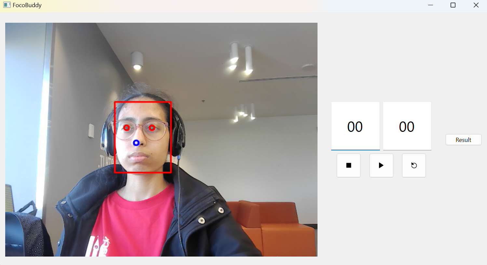
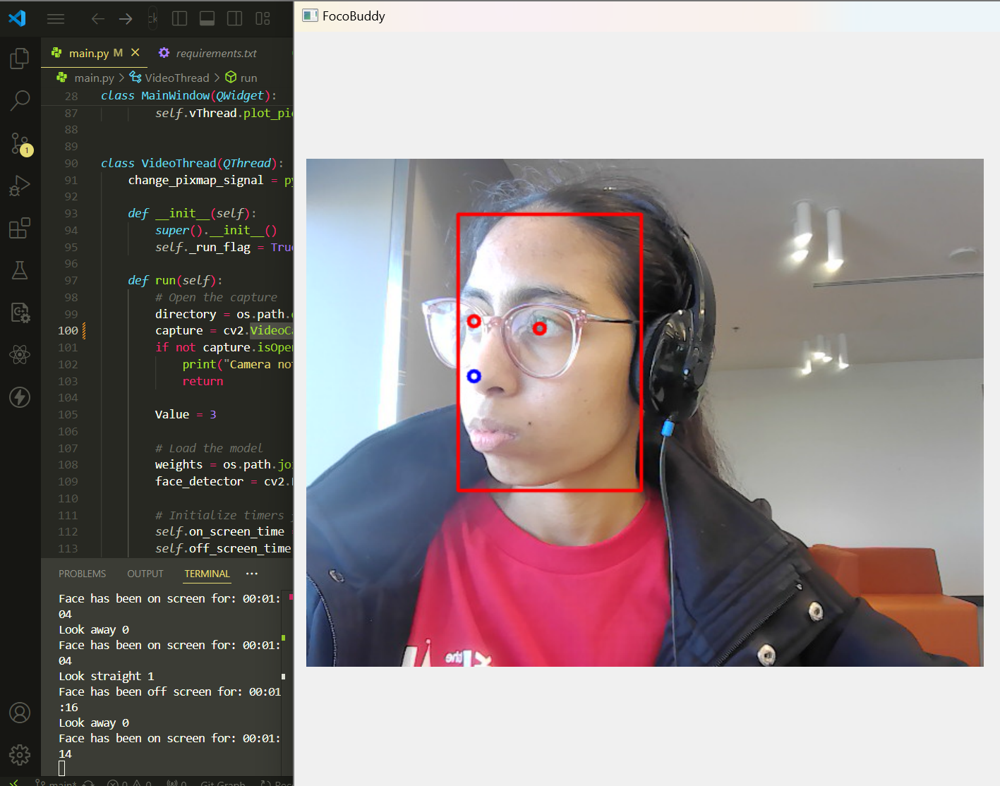
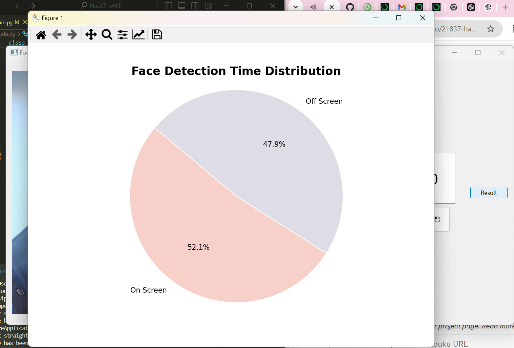

# HackTheHill

## Inspiration

Our inspiration for FocoBuddy came from the increasing challenge of maintaining focus in a world filled with distractions. We recognized that many students and professionals struggle to concentrate for extended periods, often leading to decreased productivity and increased stress. This motivated us to create a solution that combines technology with behavioral insights to help users regain control over their attention.

## What it does

FocoBuddy addresses the issue of distractions and lack of focus by providing real-time feedback on user attention, helping users stay focused and improve productivity. The app tracks eye movement & let's the user know when they are not focusing on the object.

## How we built it

We built FocoBuddy using a combination of eye-tracking technology and software development tools. The core components include:
- **Eye-Tracking Software:** Utilized to monitor user attention.

## Challenges we ran into
Throughout the development process, we faced several challenges:
- **Technical Integration:** Merging different technologies for eye tracking required significant effort and troubleshooting.
- **User Interface Design:** Creating an intuitive user interface that effectively communicates feedback without being distracting was a balancing act.

## Accomplishments that we're proud of

We are proud of several accomplishments:
- **Successful Prototype Development:** We developed a functional prototype that successfully integrates all key features.

## What we learned

Through the development of FocoBuddy, we learned:
- **New Technologies Mastered:** It was our first time working with OpenCV and PyQT6, and we’re proud of the progress we made mastering these tools.
- **User-Centric Design Matters:** We realized that truly understanding user needs is essential for building tools that effectively enhance focus and productivity.
- **Adaptability is Key:** We learned to stay flexible, adapting to challenges and continuously improving our solutions throughout the development process.

## What's next for FocoBuddy

Looking ahead, we plan to:
- **Enhance Features:** Incorporate additional features such as customizable notifications, integration with productivity tools, and gamification elements to encourage regular use.
